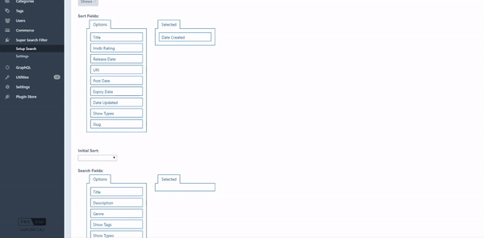
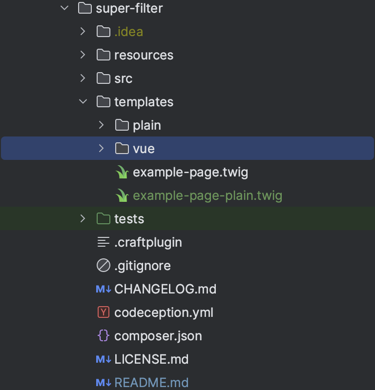

# Super Filter plugin for Craft CMS 3.x  
  
Build your search page with search filters from your element fields and filter element entries by categories, tags, element relations, products (Craft Commerce) and other fields. 
Easily setup your search page by using twig variable functions, back-end coding not needed.
Supports Vue.js with pre-built styles. 
  
  
  
## Requirements  
  
This plugin requires Craft CMS 3.2.0 or later.  
  
## Installation  
  
To install the plugin, follow these instructions.  
  
 1. Open your terminal and go to your Craft project:  
  
        cd /path/to/project  
  
 2. Then tell Composer to load the plugin:  
  
        composer require pdaleramirez/super-filter  
  
 3. In the Control Panel, go to Settings -> Plugins and click the “Install” button for Search Filter.  
 4. Go to Super Filter -> Setting and click **Install Example Data** button  to generate example entries (Optional).
  
## Configuring Search Filter  
1. Create new setup entry in Setup Search tab and click new setup
2. Setup Config:
- Title - to easily identify your setup.
- Handle - needed to initialize search setup.
- Items per page - number of entries on page content load or pagination.
- Template Override Folder - the folder of the templates that you'll override to modify html's. 
The items.twig must be copied to this folder to modify element attributes.
- Base Template - if no template is found on the template override folder it will fallback to base pre built templates.
    
- Element - the element type of the items or entries to be displayed.
- Container - section, group or product type for an element.
- Sort Fields - drag fields to selected column to be displayed on sorting template for sorting elements.
- Initial Sort - the default sort query on page load.
- Search Fields - drag fields to selected column to be displayed on search field template for filtering elements.

  
## Using Super Filter  
     
1. Use super filter twig function to display search sections on your page. There are 5 twig function to be called
on your page template.     
    - `craft.superFilter.setup('handle')` - requires 1 parameter which is the handle of search set up entry. This should be 
    the first function to be added to the template or the order of declaration should be above all other super filter twig function.
        - Template filename: `setup.twig`
        
    - `craft.superFilter.displaySearchFields()` - displays the search filter fields html.
         - Template filename: `fields.twig` and individual form input html in `fields/*` folder.
         
    - `craft.superFilter.displaySortOptions()` - displays the sorting field dropdown html.
        - Template filename: `sorts.twig`
        
    - `craft.superFilter.items()` - displays the element entries or filtered element entries.
        - Template filename: `items.twig`
        
    - `craft.superFilter.getPaginateLinks()` - displays element entries pagination or the infinite scroll trigger.
         - Template filename: `pagination.twig`
    - `craft.superFilter.close() ` - needed to close the search page to reset templates path. So if you have included template after the super filter twig functions you will need this.
2. To override a template or templates of the twig function from the selected base pre-built style templates. You can create the twig file 
or open the super-filter plugin folder and copy a template or templates to the site template override folder path you specified on your configuration

   

If you choose a template style that has Vue.js make sure to wrap it with a div id of **search-app**

The page template should look like this:
```
<div id="search-app">
    {{ craft.superFilter.setup('searchList') }}
    <div class="row">
        <div class="col-sm-2 col-md-2">
            {{ craft.superFilter.displaySearchFields() }}
        </div>
        <div class="col-sm-10 col-md-10">
            {{ craft.superFilter.displaySortOptions() }}
            {{ craft.superFilter.items() }}
            {{ craft.superFilter.getPaginateLinks() }}
            {{ craft.superFilter.close() }}
        </div>
    </div>
</div>
```

## Customization
- Pre-filter - If you want your items to load with pre defined filters you can pass a json key value pair in the `craft.superFilter.setup`
twig function second parameter e.g.
```
{{ craft.superFilter.setup('searchList', {
    superFilterImdbRating: 8,
    superFilterGenre: [13]
}) }}
```
- Item results modification - Call item event hook that allows you to modify the search and item results from an ajax results.
E.g.
```
Event::on(SearchTypes::class, SearchTypes::EVENT_ITEM_ARRAY, function (ItemArrayEvent $event) {
    if (Craft::$app->getPlugins()->isPluginEnabled('commerce') == true
        && $event->searchType instanceof ProductSearchType) {
        $event->item['variants'] = $event->element->getVariants();
    }
});
```

Contact me for inquiries or if you require more customization. <dalefirstpage@gmail.com>
